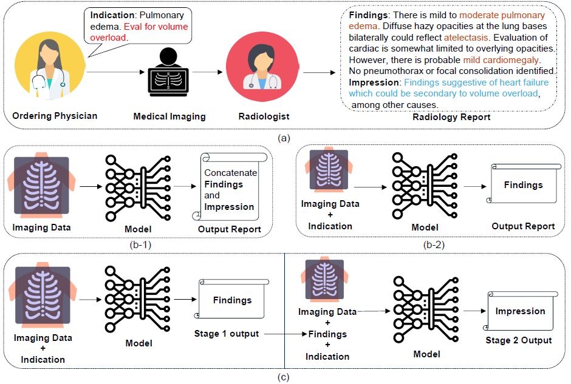

# 🩺 Filling in the Missing Piece: Advancing Automated Radiology Report Generation with Clinical Insights

[](https://dicta2025.org/)
[](https://physionet.org/content/mimic-cxr-jpg/2.1.0/)
[](LICENSE)

Official repository and dataset curation artifacts for the **DICTA 2025 Oral Presentation**:  
**"Filling in the Missing Piece: Advancing Automated Radiology Report Generation with Clinical Insights"**  
*Chaohan Wang, Qi Chen, Yutong Xie, Qi Wu*

---

## 🔍 Overview

<p align="center">
  
</p>

> **Figure Caption:** Comparison of real-world radiology workflow **(a)**, two main paradigms in previous works **(b-1 & b-2)**, and our proposed approach **(c)**.  
> In **(a)**, the clinical question is highlighted in red. Findings closely related to the indication are highlighted in brown. The impression directly addresses the clinical question (highlighted in blue). Our paradigm takes imaging data and the indication as inputs, progressively generating the findings and the impression.

---

## ⚡ Quick Start

This project leans towards **Knowledge Discovery and Verification** in automated medical report generation. 

* **Codebase Foundation:** Our implementation is built upon [R2GenGPT](https://github.com/wang-zhanyu/R2GenGPT.git).
* **Code Release:** Model training and evaluation code will be released soon. Stay tuned!

---

## 📂 Data Availability & Repository Artifacts

Due to PhysioNet credentialing policies, we are not at liberty to directly distribute derived raw text or images from MIMIC-CXR. Please request official access and download raw data directly from [PhysioNet MIMIC-CXR-JPG (v2.1.0)](https://physionet.org/content/mimic-cxr-jpg/2.1.0/).

This repository publicly provides the curation byproducts generated during the creation of **MIMIC-CXR-JPG-Ext-1v3**:

| File Name | Description | Size / Count |
| :--- | :--- | :--- |
| **`MIMIC-CXR-JPG-Ext-1v3-Phrases.txt`** | Standardized list of miscategorized/technique phrases removed during report cleaning. | 536 phrases |
| **`med_abbr_acronym.csv`** | Cleaned lookup table of clinical abbreviations and expanded full spellings. | 2,839 pairs |

---

## 📊 MIMIC-CXR-JPG-Ext-1v3 Dataset

### 📝 Abstract
**MIMIC-CXR-JPG-Ext-1v3** is derived from the MIMIC-CXR dataset, specifically structured to facilitate automated radiology report generation. It contains frontal-view chest radiographs paired with corresponding radiology reports, each explicitly segmented into three clinically relevant sections:
1. **Indication** *(Clinical Context)*
2. **Findings** *(Factual Imaging Observations)*
3. **Impression** *(Diagnostic Interpretations relative to the Indication)*

This structured format emphasizes the relationships among these sections, enabling improved alignment of automated report generation methods with the clinical workflow of radiologists and promoting explicit learning of clinical reasoning processes embedded within radiology documentation.

### 📈 Dataset Statistics

The dataset comprises **121,877 radiograph-report pairs**, strictly following the original MIMIC-CXR-JPG split boundaries:

| Split Subset | Radiograph-Report Pairs |
| :--- | :--- |
| **Training** | 119,395 |
| **Validation** | 936 |
| **Testing** | 1,546 |
| **Total** | **121,877** |

---

## 💡 Background & Motivation

Radiology reports serve as a crucial communication tool directing patient care. Despite advances in automated report generation, existing deep learning models often oversimplify the process, lacking consensus on input selection, ground-truth usage, and output structure:
* Most approaches rely solely on imaging data, treating findings and impressions as a single unstructured text block.
* Recent works incorporate indications but generate only the findings section, neglecting the critical diagnostic conclusions in the impression.

Furthermore, raw MIMIC-CXR reports are loosely delineated by keywords (`WET READ`, `TECHNIQUE`, `INDICATION`, `IMPRESSION`), resulting in severe inconsistencies:
* **57,570 reports** lack the findings section.
* **69,455 reports** omit the impression section.
* Official parsing scripts frequently miscategorize positioning notes or technique details into findings (e.g., *"Two frontal chest radiographs were obtained with patient positioned upright"*).
* Administrative clutter (e.g., *"Findings were conveyed by Dr. to at 15:33"*) creates noise during model training.

**MIMIC-CXR-JPG-Ext-1v3** resolves these limitations by providing a clean, standardized testbed reflecting real-world clinical reasoning.

---

## 🛠️ Curation Methodology

Creation of **MIMIC-CXR-JPG-Ext-1v3** involved three primary preprocessing pipelines:

```text
  Raw MIMIC-CXR Reports & Images
                 │
                 ▼
  ┌──────────────────────────────┐
  │ 1. View Selection            │ ──► Exclusively keep single Frontal Views (AP/PA)
  └──────────────┬───────────────┘
                 │
                 ▼
  ┌──────────────────────────────┐
  │ 2. Abbreviation Expansion    │ ──► Expand 2,839 acronyms via Radiopaedia standardization
  └──────────────┬───────────────┘
                 │
                 ▼
  ┌──────────────────────────────┐
  │ 3. Parsing & Cleaning        │ ──► Manual review (~20k reports) + 536 phrase filters
  └──────────────┬───────────────┘     Remove incomplete reports missing core sections
                 │
                 ▼
  MIMIC-CXR-JPG-Ext-1v3 (121,877 Pairs)
```

1. **View Selection:** Frontal projections (AP/PA) represent ~64.5% of MIMIC-CXR images. To ensure standard spatial consistency, we filtered multi-view studies to retain exactly **one frontal-view image per report pair**.
2. **Expanding Abbreviations & Acronyms:** Standardized medical abbreviations sourced from [Radiopaedia](https://radiopaedia.org/) were expanded across all indication sections to maximize semantic clarity.
3. **Report Parsing & Cleaning:** Extracted structured sections using MIMIC-CXR official tools, combined with manual auditing of ~20,000 reports to isolate 536 misassigned or administrative phrases. Reports missing all three core sections were discarded.

---

## 📖 Data Schema

The processed dataset mapping file (`MIMIC-CXR-JPG-Ext-1v3.csv`) includes seven fields:

* `study_id`: Unique identifier for the imaging study.
* `subject_id`: Patient-level identifier.
* `split`: Data split (`train`, `validate`, `test`).
* `indication`: Text specifying clinical context and reason for examination.
* `findings`: Factual observations derived from imaging data.
* `impression`: Diagnostic conclusion responding directly to the indication query.
* `image_path`: Relative file path to the corresponding JPG radiograph.

---

## 🎯 Usage Notes

**MIMIC-CXR-JPG-Ext-1v3** serves as training and benchmark data for our **Radiologist-Like Progressive Generation (RLPG)** framework. Beyond report generation, potential applications include:
1. Training models that leverage inter-sectional dependencies between indication, findings, and impression.
2. Investigating how clinical context in the indication influences factual observation density in findings.
3. Developing clinical decision-support tools and benchmarking medical AI reasoning capabilities.

---

## 📝 Citation

If you use **MIMIC-CXR-JPG-Ext-1v3** or our clinical insights framework in your research, please cite our paper:

```bibtex
@inproceedings{wang2025filling,
  title     = {Filling in the Missing Piece: Advancing Automated Radiology Report Generation with Clinical Insights},
  author    = {Wang, Chaohan and Chen, Qi and Xie, Yutong and Wu, Qi},
  booktitle = {Digital Image Computing: Techniques and Applications (DICTA)},
  year      = {2025}
}
```